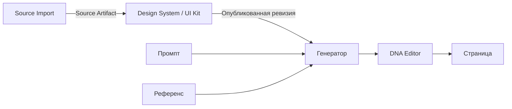

# DesignDNA

Локальная студия веб-дизайна: импорт сайта или изображения, извлечение компонентов и дизайн-системы, генерация экранов, редактирование и сборка страниц на графе нод. Основной продукт — desktop-приложение на Electron. Браузерный режим нужен для разработки и проверок.

**AI выбирает пользователь: Claude или GPT.** В текущем коде GPT доступен через OpenAI API и Codex; Claude — через Claude Code. Выбор модели, способ подключения и уровень усилия — разные настройки. Их фактические ограничения описаны в [AI.md](docs/AI.md).

Документация переписана по рабочему дереву **6 сентября 2026 года**, включая незакоммиченные изменения. Это описание реализации и отдельный план улучшений, а не заявление о готовности релиза.

## С чего начать

| Задача | Документ |
| --- | --- |
| Запустить проект, выполнить проверки, собрать desktop | [Разработка](docs/DEVELOPMENT.md) |
| Понять слои приложения, данные и границы ответственности | [Архитектура](docs/ARCHITECTURE.md) |
| Подключить Claude/GPT и понять маршрутизацию | [AI-контракт](docs/AI.md) |
| Импортировать сайт, собрать UI Kit, создать и изменить экран | [Сценарии и ноды](docs/NODES.md) |
| Понять fidelity, Quality Pass, strict и сохранение | [Качество и проверка](docs/QUALITY.md) |
| Увидеть найденные проблемы с кодом и скриншотами | [Сеньорский разбор](docs/AUDIT.md) |
| Выбрать следующие задачи и критерии приёмки | [План улучшений](docs/ROADMAP.md) |
| Подключить проект к агенту через MCP | [MCP](docs/MCP.md) |

## Основной сценарий

Импорт сохраняет измеренную структуру, ассеты и происхождение данных. Дизайн-система хранит мастера и ревизии. Генератор получает задачу, выбранную систему и референс. Редактор меняет Design IR; граф передаёт результат дальше.

В проекте также существуют локальная анимация/Timeline и внешняя генерация видео. Последняя сейчас использует Seedance через OpenRouter и **не соответствует ограничению на два AI-семейства**. Это открытая продуктовая задача, а не рекомендуемый основной маршрут.

## Текущая проверка

- Desktop: **307/307** тестов.
- Frontend: **71/71** тестов выбранного набора; Svelte — **0 ошибок, 0 предупреждений**.
- Python: **135/135** тестов выбранного набора.
- В браузере проверены стартовые графы, смена модели и открытие DNA Editor с локальным примером; сохранены скриншоты.

Полный Python-набор, полный browser E2E, реальные платные AI-вызовы и упаковка релиза в этот раз не выполнялись. Методика и команды — в [QUALITY.md](docs/QUALITY.md).

Старые центральные документы и handoff сохранены в проверенный локальный ZIP: `artifacts/docs-refresh-2026-09-06/previous-documentation.zip`. Активная документация находится здесь и в `docs/`. Исполняемые AI-промпты, навыки, данные и исторические отчёты проверок сохранены.
