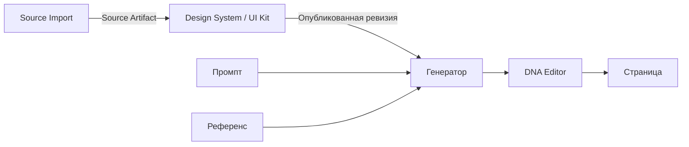

# DesignDNA

Локальная студия веб-дизайна: импорт сайта или изображения, извлечение компонентов и дизайн-системы, генерация экранов, редактирование и сборка страниц на графе нод. Основной продукт — desktop-приложение на Electron. Браузерный режим нужен для разработки и проверок.

**AI выбирает пользователь: Claude или GPT.** В продукте оба работают через подписочные аккаунты пользователя: GPT через Codex, Claude через Claude Code. Выбор провайдера и уровня усилия делается в ноде. По API-ключу работает только Seedance через OpenRouter (видео). Как приложение передаёт инструкции обоим CLI и что проверено, описано в [AGENT-CONTRACT.md](docs/AGENT-CONTRACT.md).

Карта репозитория для агентов и людей: [AGENTS.md](AGENTS.md). Документация обновлена **8 сентября 2026 года**. Это описание реализации и отдельный план улучшений, а не заявление о готовности релиза.

## С чего начать

| Задача | Документ |
| --- | --- |
| Запустить проект, выполнить проверки, понять слои и инварианты | [AGENTS.md](AGENTS.md) |
| Понять, как приложение говорит с Claude Code и Codex | [Контракт агентов](docs/AGENT-CONTRACT.md) |
| Увидеть разбор бэкенда и план улучшений | [Backend-ревью](docs/BACKEND-REVIEW-2026-09-08.md) |
| Понять ноды, листы и жизненный цикл задач | [Ноды и выполнение](docs/node-execution.md) |
| Увидеть ревью всех типов нод и результаты проверок | [Ревью нод](docs/all-nodes-review-2026-09-08.md) |
| Понять дизайн-политику генератора | [Playbook генератора](docs/generator-design-playbook/README.md) |
| Работать с нодами изображений | [Ноды изображений](docs/image-nodes.md) |
| Подключить проект к внешнему агенту через MCP | [SKILL.md](skills/designdna/SKILL.md) |

Старые документы (ARCHITECTURE, AI, MCP, ROADMAP, QUALITY) сохранены в `artifacts/docs-refresh-2026-09-06/previous-documentation.zip` и `docs/archive/`; в рабочем дереве их нет.

## Основной сценарий

Импорт сохраняет измеренную структуру, ассеты и происхождение данных. Дизайн-система хранит мастера и ревизии. Генератор получает задачу, выбранную систему и референс. Редактор меняет Design IR; граф передаёт результат дальше.

В проекте также существуют локальная анимация/Timeline и внешняя генерация видео. Последняя сейчас использует Seedance через OpenRouter и **не соответствует ограничению на два AI-семейства**. Это открытая продуктовая задача, а не рекомендуемый основной маршрут.

## Текущая проверка

- Desktop: **307/307** тестов.
- Frontend: **71/71** тестов выбранного набора; Svelte — **0 ошибок, 0 предупреждений**.
- Python: **135/135** тестов выбранного набора.
- В браузере проверены стартовые графы, смена модели и открытие DNA Editor с локальным примером; сохранены скриншоты.

Полный Python-набор, полный browser E2E, реальные платные AI-вызовы и упаковка релиза в этот раз не выполнялись. Методика и команды — в [AGENTS.md](AGENTS.md).

Исполняемые AI-промпты (`app/prompts/`), навыки (`skills/`), схемы (`schema/`) и исторические отчёты проверок сохранены. Методика проверок и команды: [AGENTS.md](AGENTS.md).
