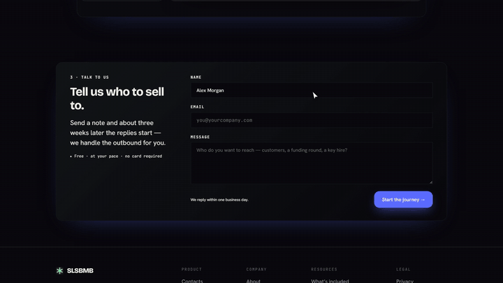
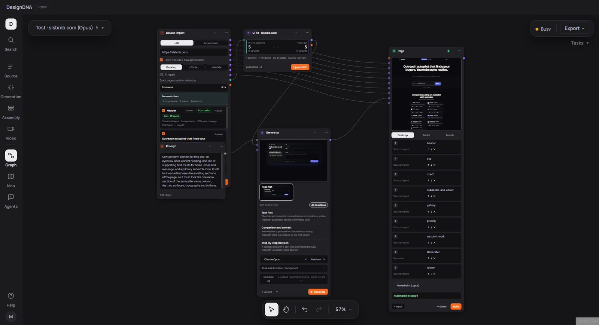
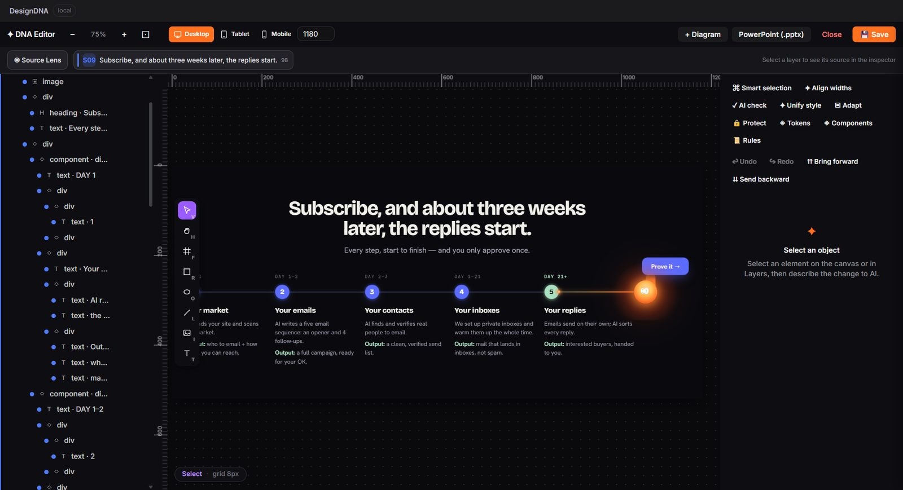
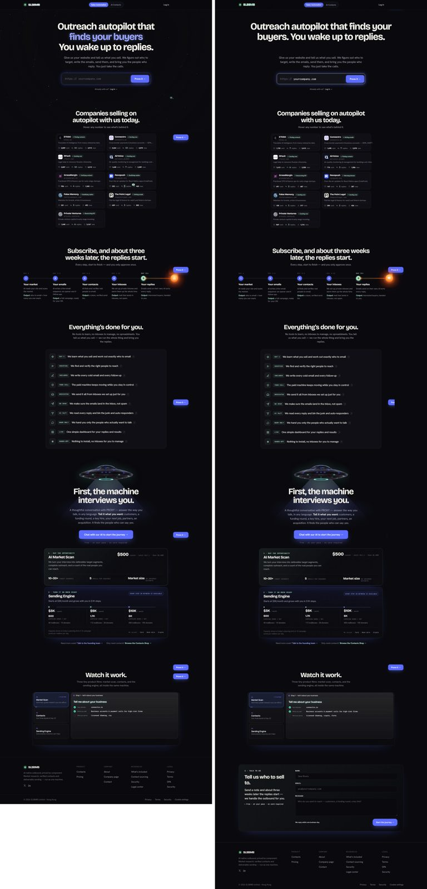
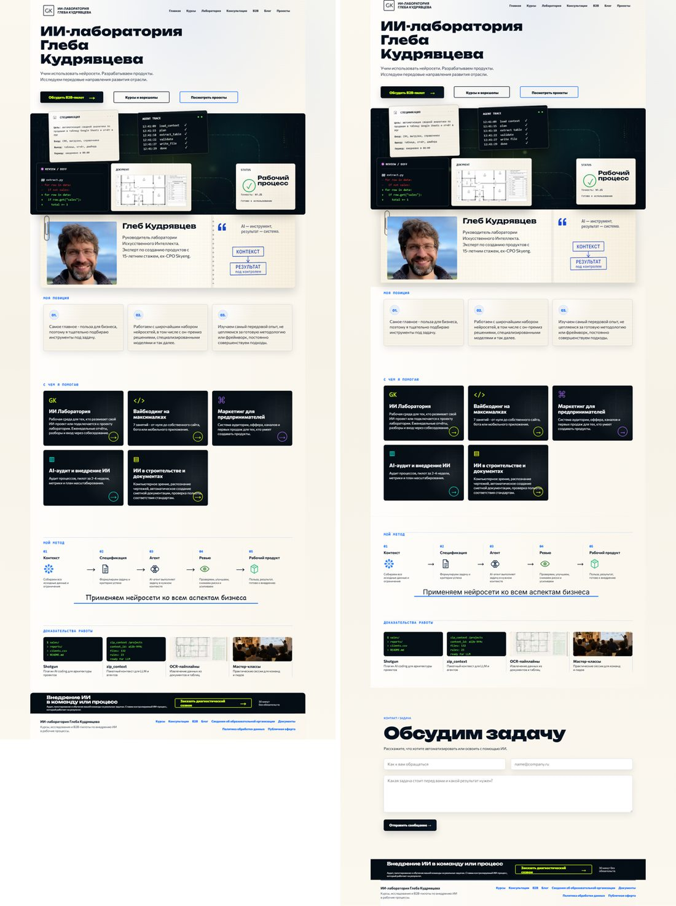
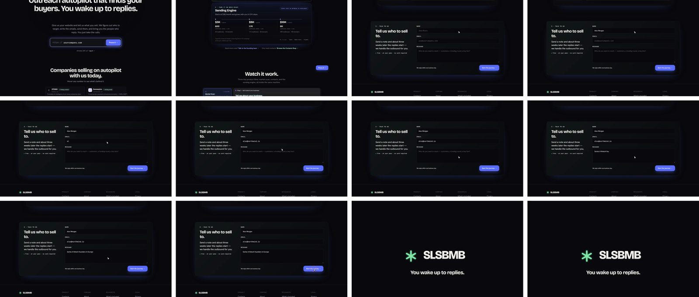

# DesignDNA

**Локальная AI-студия веб-дизайна, которая изучает живой сайт и проектирует на его языке.**

Импортируйте любой сайт в точные редактируемые слои, соберите из него проверенный UI Kit, сгенерируйте новые секции в стиле страницы, пересоберите страницу и срежиссируйте по ней моушн-ролик с курсором, который заполняет формы, и финальной карточкой с логотипом. Всё это работает в десктопном графе нод с GPT или Claude по вашим подпискам Codex и Claude Code.

[](https://github.com/MaxBaranov1993/designdna/actions/workflows/desktop.yml)




*Ролик выше целиком сделан в DesignDNA по сайту [slsbmb.com](https://slsbmb.com/) моделью Claude Opus: импорт источника, UI Kit, форма обратной связи в стиле сайта, вставка в страницу, режиссура и рендер видео.*

> **English version:** [README.md](README.md) · **Бета-тестерам:** начните с раздела [Бета-тестирование](#бета-тестирование).

---

## Чем отличается

### 1. Точный импорт живого сайта
Вставьте URL и примерно через 30 секунд получите страницу в виде **редактируемых абсолютных слоёв**, как html.to.design делает для Figma. Импорт:
- загружает страницу один раз и заранее прокручивает ленивый контент;
- подгружает веб-шрифты, которые браузер пропустил, чтобы текст измерялся в настоящем шрифте;
- делит страницу на секции по геометрии;
- сохраняет скриншоты страницы как свидетельства.

Планшетный и мобильный захват добавляются по запросу. На нашем стенде точности отрисованный импорт совпадает с живой страницей на **0,99** визуального сходства для slsbmb.com и rsale.net и на **0,91** для насыщенного анимацией glebkudr.com.

### 2. Дизайн-система, извлечённая из сайта и сверенная с ним
Нода UI Kit превращает захваченные секции в **мастера**, переиспользуемые компоненты кита. AI-ревьюер со зрением сравнивает каждый мастер с кропом источника, прежде чем принять его. Опубликованные киты — **неизменяемые ревизии**. Кит также измеряет **оболочку секции** страницы: колонку, ритм, надзаголовок, стили заголовков и текста, поверхности и кнопки.

### 3. Генерация, которая встаёт в существующую страницу
Подключите UI Kit к Генератору, и новые секции получат **колонку, отступы, шрифты, цвета и поверхности сайта**, а не общий шаблон. Цикл **Quality Pass** оценивает каждый результат моделью со зрением и дорабатывает его в несколько раундов.

### 4. Исходная страница, собранная заново
Нода **Page** пересобирает страницу источника секция за секцией, на исходных позициях и поверх собственного фона сайта. Сгенерированные секции можно вставить **между любыми двумя блоками**.

### 5. Моушн-режиссёр для продуктовых роликов
Нода **Video** превращает страницу в ролик, режиссуру ведёт выбранная вами модель:
- панорамы камеры и появления, синхронизированные с камерой;
- курсор, который печатает в поля формы и нажимает кнопки;
- переходы между страницами: `zoom`, `slide`, `motion`;
- финальные карточки и эффекты размытия, маски и фокуса.

Рендер **детерминированный и офлайновый**, с параллельными воркерами, сразу в MP4. Каждая правка AI — обратимый набор изменений.

### 6. GPT и Claude по вашим подпискам, без API-ключей
В каждой AI-ноде выбирается одно из двух семейств моделей:
- **GPT** (GPT‑5.6 Sol, GPT‑6 Astra) через ваш вход в **Codex**;
- **Claude** (Claude Opus) через ваш вход в **Claude Code**.

Приложение запускает CLI, в которые вы уже вошли, в изолированном рабочем каталоге, с выключенными инструментами и без загрузки ваших личных настроек агента. Единственный ключ необязателен: генерация видео Seedance через OpenRouter.

### 7. Всё локально
Проекты хранятся в локальной базе SQLite. Изображения — файлы на вашем диске с адресацией по содержимому. С компьютера уходят только запущенные вами вызовы моделей. Внешние агенты могут управлять студией через встроенный **MCP-сервер** ([скилл](skills/designdna/SKILL.md)).

## Сравнение с аналогами

Честное сравнение на высоком уровне с типичными сценариями соседних инструментов на сентябрь 2026 года. Эти продукты быстро меняются, поэтому таблица — ориентир, а не спецификация.

| | DesignDNA | Импорт сайта в Figma (например, html.to.design) | AI-генераторы интерфейсов и приложений (например, v0, Lovable, Bolt, Stitch) | Запись экрана |
| --- | :---: | :---: | :---: | :---: |
| Начинает с **вашего живого сайта** | ✓ | ✓ | частично (скриншоты, промпты) | ✓ (запись) |
| **Редактируемые слои** захваченной страницы | ✓ | ✓ | — | — |
| **Дизайн-система** извлекается и **сверяется** с источником | ✓ | — | — | — |
| Новые секции **в стиле и сетке сайта** | ✓ | вручную | зависит от промпта | — |
| **Пересборка страницы** со вставленными сгенерированными секциями | ✓ | вручную | — | — |
| **Срежиссированный ролик** по дизайну (камера, ввод, клики, финальная карточка) | ✓ | — | — | ручная запись |
| **Локальное десктопное приложение**, проекты на вашем диске | ✓ | облако Figma | облако | по-разному |
| Запускает **GPT и Claude** по подпискам Codex / Claude Code, за которые вы уже платите | ✓ | — | свои кредиты | — |

## Скриншоты

| Граф нод | DNA Editor |
| --- | --- |
|  |  |

| slsbmb.com: живая страница (слева) и Page в DesignDNA со сгенерированной формой (справа) | glebkudr.com: живая страница (слева) и Page в DesignDNA (справа) |
| --- | --- |
|  |  |

Раскадровка 24-секундного продуктового ролика: прокрутка страницы, заполнение формы, клик, переход с приближением, логотип.



## Бета-тестирование

DesignDNA в **публичной бете (desktop 0.5.4)**. Спасибо, что тестируете! Самый ценный отзыв — реальный сайт, нода, на которой что-то пошло не так, и скриншот.

### Требования

- **Windows 10/11** (основная платформа тестирования). macOS и Linux проходят CI, но вручную проверяются реже.
- **Node.js 24**, **Python 3.12+**, **Git**.
- Хотя бы один CLI с выполненным входом:
  - [Claude Code](https://docs.anthropic.com/en/docs/claude-code) с планом Claude Pro или Max, и/или
  - [Codex CLI](https://github.com/openai/codex) с планом ChatGPT.
- Необязательно: ключ OpenRouter для генерации видео Seedance.

### Установка и запуск из исходников

Готовых установщиков пока нет, приложение запускается из исходников:

```bash
git clone https://github.com/MaxBaranov1993/designdna.git
cd designdna
python -m venv .venv
```

Windows:

```bash
.venv\Scripts\python -m pip install -r requirements.txt
.venv\Scripts\python -m playwright install chromium
```

macOS / Linux:

```bash
.venv/bin/python -m pip install -r requirements.txt
.venv/bin/python -m playwright install chromium
```

Затем:

```bash
npm ci --prefix frontend
npm ci --prefix desktop
npm run desktop:start
```

При первом запуске откройте **Agents → Connections** и убедитесь, что Claude Code и/или Codex отмечены как подключённые.

### Тестовый прогон на 15 минут

1. **Source Import**: вставьте URL сайта, который принадлежит вам или который вам разрешено копировать, отметьте *I own this site / have permission* и запустите. При желании добавьте Tablet или Mobile.
2. **UI Kit**: создайте его из ноды Source. AI-ревью проверит мастера и опубликует ревизию.
3. **Generator**: подключите UI Kit и Prompt, например *"Contact form section for this site"*. В ноде выберите GPT или Claude.
4. **Page**: подключите блоки Source и сгенерированную секцию в любом порядке и запустите.
5. **Video**: подключите Page, откройте **Editor** и опишите ролик. Например: *"Scroll to the form, type a name and email, click the button, then zoom to the logo."* Затем нажмите **Render MP4**.

### О чём особенно хотим услышать

- Сайты, которые плохо импортируются: пропавшие элементы, неверные шрифты, сдвинутые секции. Пожалуйста, укажите URL.
- Сгенерированные секции, которые не похожи на остальной сайт.
- Ролики с пустыми кадрами, дёрганой камерой или неверными целями.
- Всё, что непонятно в интерфейсе.

Откройте issue по шаблону **Bug report** или **Beta feedback**. Полезно приложить:
- скриншот;
- провайдера и модель, которыми пользовались;
- трассу вызовов моделей `%APPDATA%\@designdna\desktop\data\traces\llm-calls.electron.jsonl`. В ней только метаданные, без промптов и ключей.

### Известные ограничения

- Сайты с агрессивной защитой от ботов или постоянной анимацией могут импортироваться частично. Декоративные анимированные слои могут оказаться застывшими.
- Некоторые акцентные эффекты текста, например слова с градиентной подсветкой, могут импортироваться обычным текстом.
- Для недоступного сайта сейчас показывается медленный 12-минутный таймаут импорта вместо немедленной ошибки.
- Очень длинные страницы режиссируются в ролики длиной до 20 секунд.
- AI-шаги выполняются на вашей подписке и расходуют лимиты вашего плана.

### Приватность

- Проекты, захваты, UI Kit и рендеры хранятся в `%APPDATA%\@designdna\desktop\data` (Windows) или аналогичном каталоге платформы.
- Содержимое AI-шагов отправляется только провайдеру, выбранному в ноде, через ваш собственный Claude Code / Codex CLI.

## Документация

| Тема | Документ |
| --- | --- |
| Карта репозитория, команды, инварианты (для контрибьюторов и агентов) | [AGENTS.md](AGENTS.md) |
| Ноды, выполнение, Source Import, хранение проекта | [docs/node-execution.md](docs/node-execution.md) |
| Как дизайн-система попадает в промпт генератора | [docs/design-system-prompt-2026-09-09.md](docs/design-system-prompt-2026-09-09.md) |
| Видео: моушн-режиссёр, сценарии, рендер | [docs/video-motion-director.md](docs/video-motion-director.md) |
| Как приложение говорит с Claude Code и Codex | [docs/AGENT-CONTRACT.md](docs/AGENT-CONTRACT.md) |
| Дизайн-политика генератора | [docs/generator-design-playbook/README.md](docs/generator-design-playbook/README.md) |
| MCP-инструменты для внешних агентов | [skills/designdna/SKILL.md](skills/designdna/SKILL.md) |

## Разработка

```bash
npm --prefix desktop test
node --test frontend/tests/*.test.mjs
.venv/Scripts/python -m pytest app -q --ignore-glob="app/ui_*" --ignore-glob="*_live_test.py"
```

Подробности, соглашения и полная матрица CI — в [AGENTS.md](AGENTS.md) и [.github/workflows/desktop.yml](.github/workflows/desktop.yml).
