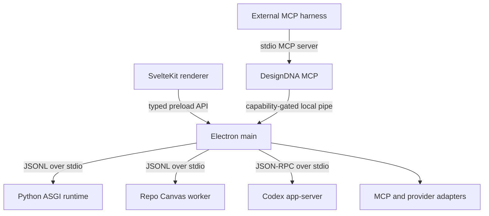

# DesignDNA desktop runtime

DesignDNA is one product and one desktop runtime. Repo Canvas is a feature surface inside DesignDNA, not a second web application.

## Production topology

The production application opens no local HTTP port. Electron loads the compiled SvelteKit bundle from disk. Existing FastAPI routes run in-process through the ASGI protocol in `app/desktop_worker.py`, so the editor keeps its current contracts without Uvicorn or `localhost`. The browser/FastAPI launch remains a development and compatibility mode. External MCP harnesses reach the running editor through a local Windows named pipe or POSIX Unix-domain socket; this is not a network server.

The Python worker speaks JSONL over stdio and handles one request at a time. The host therefore runs a second interactive Python worker for fast routes (editor AI assist), serialized per worker through `desktop/lib/serial-request-queue.mjs`, so quick round-trips never queue behind multi-minute Source Import captures.

## Trust boundaries

- The renderer has no Node.js access. `contextIsolation`, sandboxing and a narrow preload API are mandatory.
- Provider secrets never cross into the renderer. They are encrypted with Electron `safeStorage` and only referenced by provider id.
- Source Import login ("Source Login") runs in an isolated, sandboxed Electron session partition; the extracted cookies are host-scoped and sanitized (`desktop/services/source-auth.mjs`) before being injected into the capture request, and are never exposed to the renderer.
- Repo Canvas owns its event store but runs as a child worker. Its old HTTP server is not started by the desktop app.
- Design IR remains the source of truth. Desktop integration does not introduce a second document model.
- MCP definitions are validated before persistence. Secrets belong in the encrypted credential store, not in MCP settings JSON.
- The first-party live command capability rotates on every Electron launch and
  stays in the per-user data directory. Preview is non-mutating; Apply requires
  native approval, a current base revision and persistence acknowledgement.

## Provider policy

| Provider | Desktop integration |
| --- | --- |
| OpenAI Codex | `codex app-server` over stdio; ChatGPT sign-in or an encrypted API key |
| Kimi | Local CLI/account connection when installed, with encrypted API-key fallback |
| OpenAI API | Direct API adapter with an encrypted key |
| Zhipu GLM | Direct `bigmodel.cn` adapter with its own encrypted credential |
| Z.AI GLM | Direct `api.z.ai` adapter; credential and endpoint policy remain separate from Zhipu GLM |
| xAI Grok | Direct API adapter with an encrypted key |
| ZCode | Explicit development opt-in through `ZCODE_CLI`; no packaged dependency on a private installed path |
| MCP | User-configured stdio servers, tool discovery/calls and approval gating in Electron main |
| DesignDNA MCP | Bundled saved-project tools plus the capability-gated live editor command bridge |

## Migration phases

1. **Runtime convergence (implemented):** Electron host, ASGI bridge, Repo Canvas worker, safe IPC, Design/Project Map switch.
2. **Provider orchestration (implemented):** Codex threads/turns, streamed item events, command/file approvals, MCP tool discovery/calls and dynamic-tool routing.
3. **Distribution (implemented):** Electron Forge produces Squirrel.Windows and macOS ZIP/DMG artifacts with a PyInstaller Python sidecar and bundled Playwright Chromium. Signing and notarization activate only when CI secrets are present.
4. **Live command foundation (implemented, bounded inventory):** authoritative desktop session, CAS/idempotency registry, renderer bridge, native approval and first-party MCP transport. Node create/delete/move, source-key style patch and undo are registered; the remaining editor action inventory is pending.
5. **Legacy retirement (pending):** remove the standalone Repo Canvas HTTP entry point after desktop parity is verified.
