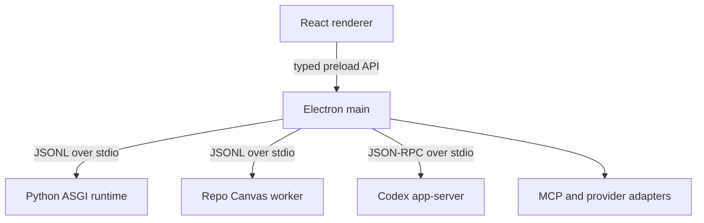

# DesignDNA desktop runtime

DesignDNA is one product and one desktop runtime. Repo Canvas is a feature surface inside DesignDNA, not a second web application.

## Production topology

The production application opens no local HTTP port. Electron loads the compiled React bundle from disk. Existing FastAPI routes run in-process through the ASGI protocol in `app/desktop_worker.py`, so the editor keeps its current contracts without Uvicorn or `localhost`. The browser/FastAPI launch remains a development and compatibility mode.

## Trust boundaries

- The renderer has no Node.js access. `contextIsolation`, sandboxing and a narrow preload API are mandatory.
- Provider secrets never cross into the renderer. They are encrypted with Electron `safeStorage` and only referenced by provider id.
- Repo Canvas owns its event store but runs as a child worker. Its old HTTP server is not started by the desktop app.
- Design IR remains the source of truth. Desktop integration does not introduce a second document model.
- MCP definitions are validated before persistence. Secrets belong in the encrypted credential store, not in MCP settings JSON.

## Provider policy

| Provider | Desktop integration |
| --- | --- |
| OpenAI Codex | `codex app-server` over stdio; ChatGPT sign-in or an encrypted API key |
| Claude | Direct provider adapter with a user-owned API key; embedded Claude subscription login is not assumed |
| Kimi | Local CLI/account connection when installed, with encrypted API-key fallback |
| MCP | User-configured stdio or HTTP servers, mediated by Electron main |

## Migration phases

1. **Runtime convergence (this change):** Electron host, ASGI bridge, Repo Canvas worker, safe IPC, Design/Project Map switch.
2. **Provider orchestration:** unified task/session model, streaming events, approval UI and MCP capability routing.
3. **Distribution:** Electron Forge packaging, signing/notarization, auto-update channels and Windows/macOS smoke tests.
4. **Legacy retirement:** remove the standalone Repo Canvas HTTP entry point after desktop parity is verified.
