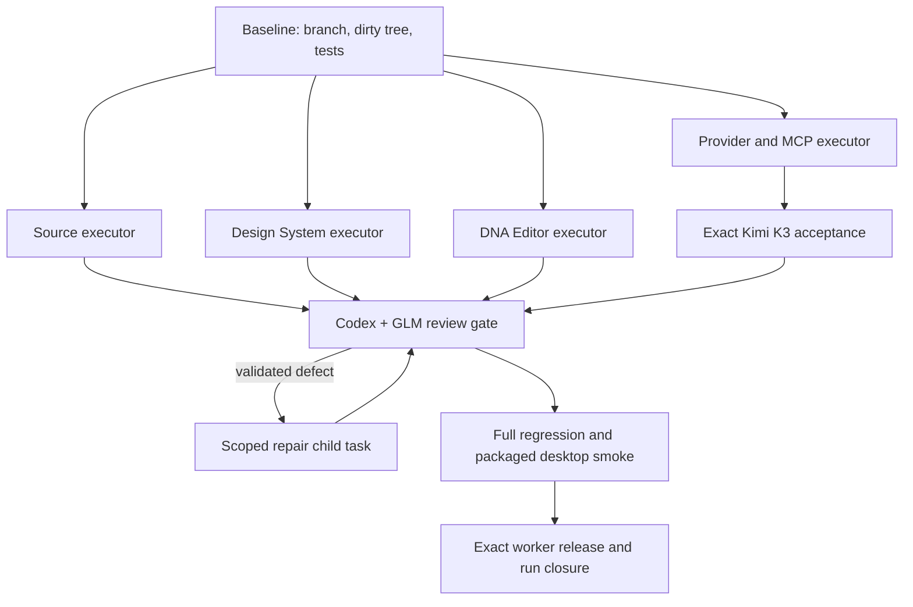

# Orca multi-agent quality pipeline

This is the repository contract for DesignDNA agent work. Orca owns task identity, dispatch, heartbeats, review gates and exact session cleanup; model CLIs remain replaceable adapters.

## Roles

| Role | Runtime | Default mode | Best scope |
| --- | --- | --- | --- |
| Executor | Kimi `kimi-code/k3` | `high`, `--yolo`, 1M context | provider/MCP contracts, Source and long repository work |
| Executor | Grok 4.6 | `high`, `always-approve` | DNA Editor, Design System and UI action matrices |
| Executor/reviewer | ZCode GLM-5.3 through Z.AI | High or Max, Full access | bounded implementation and independent architecture/code review |
| Isolated executor | Qwen `qwen3.8-max` | YOLO | video/timeline work in its dedicated worktree until independent acceptance |
| Reviewer/coordinator | Codex `gpt-5.6-sol` | `high` | scope, diff review, test reruns and final acceptance |
| Independent reviewer | ZCode GLM-5.3 through Z.AI | High or Max | P0/P1/P2 review with exact file/line evidence |

`--yolo` and Full access remove routine model confirmations. They do not override OS, repository or destructive-action safety boundaries.

## DAG



## Dispatch contract

Every task specification must include:

- exact owned files and explicitly excluded modules;
- dirty-tree preservation and no reset/stash/commit/push unless separately authorized;
- acceptance invariants and exact test commands;
- no secrets in prompts, logs or reports;
- one `worker_done` containing outcome, files, commands, failures and residual risks.

For Kimi K3 the verified model alias is `kimi-code/k3`, not `k3`:

```powershell
kimi --model kimi-code/k3 --yolo
```

The live banner must show `K3`, `thinking: high`, `yolo` and the expected context size before dispatch. If Orca cannot pass that exact alias through a provider adapter, start the exact CLI in an Orca terminal and dispatch the task to that terminal.

Grok workers use `high` plus `always-approve`. ZCode sessions must visibly show GLM-5.3, High or Max and Full access before the prompt is sent.

## Review and repair loop

1. Treat `worker_done` as a handoff, not proof.
2. The Codex coordinator checks the actual diff and reruns the narrow acceptance suite.
3. GLM-5.3 performs a read-only second review for architecture/provider boundaries and returns exact file/line evidence.
4. A validated defect becomes a new child task with a narrower ownership set; do not silently reopen or broaden the old task.
5. Repeat until the focused suite is green, then run the full repository and packaged desktop gates.

## Quota and liveness policy

- Check Orca dispatch status, terminal `lastOutputAt`, the provider banner and explicit quota/rate-limit messages.
- Long reasoning with live output is not a quota failure.
- On a confirmed quota/auth/model-unavailable failure, fence only that dispatch, preserve its diff/report, reset the task to ready and reassign it to another allowed executor.
- Never run two writers over the same owned files. Qwen video work stays in its isolated worktree until it reports completion and its commits pass independent review.

## ZCode bridge

ZCode is an authenticated Z.AI harness, not a stable production transport contract. The installed private `resources/glm/zcode.cjs` entry point has been health-checked successfully with non-interactive `--prompt --json` and GLM-5.3; its TUI import is unavailable on the same installation. Orca may therefore use headless prompt mode for bounded development tasks while recording the task id, session id and returned report, but the packaged product must use the documented Z.AI API rather than that private path. Never parse/copy ZCode credentials or send repository source to the external provider without the project owner's explicit source-sharing authorization.

## Final gates

- Source fidelity/schema/engine suite, including live deterministic acceptance where network evidence is required;
- Design System backend and Playwright lifecycle suites;
- DNA Editor action inventory and all focused UI suites;
- provider/MCP contract tests with a real local MCP fixture and two tool rounds;
- `pytest`, frontend check/build/engine tests and desktop tests;
- Python sidecar build/smoke, Electron package/make and a visible responsive desktop launch;
- exact `worker-release` for every settled worker, followed by `worker-list` and terminal inspection. Never use a broad orchestration reset to hide residual sessions.
