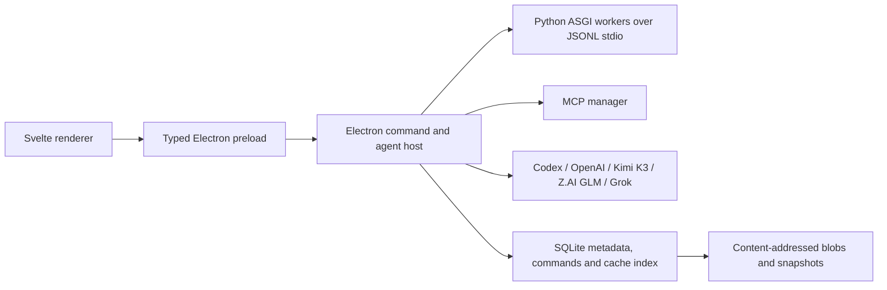

# DesignDNA senior architecture audit

Verified snapshot: 2026-08-23. The audit separates observed repository state from the target architecture.

Update verified 2026-08-25: the first live command foundation described as P1
in the original snapshot is now implemented for a bounded action inventory.
See [Current capabilities](../CURRENT-CAPABILITIES.md) and
[DesignDNA MCP](designdna-mcp.md) for the newer operational boundary. Other
findings retain their original 2026-08-23 evidence date unless explicitly
updated below.

## Decision

Keep the current Electron + Svelte 5 + Python stack. It is a good fit for a local-first design tool that needs Chromium capture, Playwright, Node/MCP integrations, native credentials and Python image/IR processing. A Tauri or native rewrite would add two runtime boundaries without solving the current fidelity, persistence or agent-contract risks.

Make desktop the only product/release surface. Retire the standalone browser build as a user-facing product, but keep FastAPI route handlers as the internal ASGI contract and as a development/test harness: `app/desktop_worker.py` invokes the same application without opening a production HTTP port.

Keep SQLite as the default local database on Windows, macOS and Linux. Do not introduce PostgreSQL into the desktop install. Normalize the local graph and add a content-addressed object store before considering optional cloud sync.

## Findings and current disposition

### P0 - required for the stated product

1. **Cross-OS distribution — repository configuration resolved; runner proof pending.** Release CI now targets Ubuntu, Windows and macOS with Node 24, Python 3.12, runtime smoke, native makers and SHA-256 artifact manifests. Forge now declares Windows Squirrel, macOS ZIP/DMG and Linux ZIP/DEB/RPM. This is repository evidence, not proof that signed/notarized artifacts have completed on all three hosted runners; do not claim production “all OS” until that matrix has run successfully with signing credentials.
2. **Source fidelity — resolved for the accepted fixture matrix.** The deterministic acceptance run now passes every desktop/mobile/tablet gate without lowering the 85 threshold: HUD 97.26/96.84/97.08, section 1 97.27/92.11/95.42 and section 2 90.81/85.20/88.02. Geometry is within 2 px, coverage is 100%, unexplained losses are zero and no raster fallback is used. Persisted assets use verified `ddna://blobs/<sha256>` references and missing/corrupt objects fail closed. New source domains still require the same live gate; this is not a universal fidelity proof.
3. **Provider envelope — resolved and independently regression-tested.** Desktop and Python transports now use explicit validation for messages, multimodal parts, tool calls/results, reasoning/sampling options, response format, timeout and provider options. Unsupported, unknown or over-limit values fail before network activity; accepted values and tool correlation survive both rounds without clipping, and explicit providers do not silently fall back. Kimi K3 completed the last clipping/name-mapping repair before its account returned a confirmed 403 quota exhaustion; Codex then inspected the diff and accepted 192 desktop tests, 68 focused Python provider tests and the 241-test full Python suite. An external GLM source review is not claimed because repository-source transmission to Z.AI was not authorized.
4. **Large-graph persistence — still open.** `frontend/src/flow/serialize.ts` still serializes a compact full-project snapshot and `app/project_store.py` stores the complete JSON document in one row. Large graphs therefore retain full stringify, transfer and rewrite costs for small edits. This is the main remaining scalability architecture item.
5. **Cache lifecycle — resolved at the cache boundary.** `app/cache_store.py` now provides canonical SHA-256 keys/integrity, WAL and busy timeout, schema migration, hit/access accounting, a 30-day TTL and bounded LRU eviction under a 512 MiB default budget. Cache provenance still has to grow with future compiler/capture formats.
6. **Desktop blobs — resolved.** The desktop object store now hashes complete bytes with SHA-256, sniffs and validates MIME, caps objects at 256 MiB, publishes atomically with create-if-absent semantics, verifies pre-existing content and fails closed on corrupt or path-shaped identifiers. The renderer only receives `ddna://blobs/<sha256>` handles, not arbitrary filesystem paths.
7. **First-party MCP — live foundation resolved; full action inventory remains P1 (updated 2026-08-25).** `app/designdna_mcp_server.py` now exposes saved-project get/put/summary, Design IR validation and `designdna_live_command` over stdio. A capability-gated local pipe reaches the running Electron host. The host owns an authoritative project session, CAS/idempotency registry, native approval, renderer dispatch and persistence acknowledgement. Registered live mutations are node create/delete/move, source-key style patch and undo; read commands cover session, project, pages, graph, command inventory and changes. Source capture, Design System lifecycle, generation, edge/page/selection commands, motion and export remain unregistered. Do not describe this bounded surface as remote control of every button.

### P1 - next structural pass

1. Continue splitting `frontend/src/editor/controller.ts`, `frontend/src/flow/store.ts`, `app/server.py` and `app/scraper.py` by domain. The typed command registry and non-mutating Preview/reversible Apply foundation now exist, but only five renderer mutations are registered; migrate the remaining UI actions into the same contract.
2. Move from full-document saves to normalized `projects`, `pages`, `nodes`, `edges`, `commands`, `snapshots`, `objects` and `cache_entries` tables. Enable WAL, `busy_timeout`, foreign keys and `user_version` migrations at one database boundary.
3. Store heavy IR, screenshots, fonts, captured assets and video frames by SHA-256 in the existing desktop blob area. Database rows and Design System revisions should reference immutable hashes instead of duplicating large JSON/data URLs.
4. Add incremental invalidation and a DAG scheduler. A node cache key should include canonical upstream hashes, node type/version, Design IR schema version, provider/model, normalized request parameters, MCP/tool configuration hash and capture/browser/asset versions.
5. Virtualize the graph viewport and expensive inspectors. Persist an append-only command log with periodic snapshots so drag, resize and text edits do not rewrite the whole graph.
6. Upgrade the runtime in controlled slices. Electron is now pinned to `43.4.1` and CI uses Node 24. Svelte `5.19` and Vite `5.4` remain behind the current Svelte 5 and Vite 8 lines; migrate them in a dedicated branch with compiler-warning cleanup and rendered editor benchmarks rather than inside the fidelity/provider repair diff.
7. Add an explicit packaged-renderer Content Security Policy. Electron already uses `contextIsolation: true`, `nodeIntegration: false`, `sandbox: true`, `webSecurity: true`, trusted main-frame IPC checks and navigation/window-open restrictions, but neither the Svelte document nor the Electron session currently installs a CSP. Define the narrowest policy compatible with local fonts/assets and `ddna:` blobs, then cover it in the packaged smoke test.
8. Treat development-tool advisories as a dedicated toolchain migration, not an automatic force-fix. The refreshed production-only npm audits are clean for both desktop and frontend. Full audits still report 22 high desktop development advisories through Forge/packaging dependencies and 8 frontend development advisories (3 low, 3 moderate, 2 high) through the Vite 5-era toolchain; upgrade Forge and Vite/Svelte in isolated branches and rerun packaging/rendered benchmarks.
9. Split large optional runtimes from the core installer. The first Windows make exposed an accidental duplicate of the 577.6 MiB Python/Playwright runtime inside `app.asar`; the packager now excludes runtime/build/output trees and reduced `app.asar` from 627.5 MiB to 1.9 MiB and Setup from 793.3 MB to 511.3 MB. The remaining unpacked payload is dominated by the required Python/Playwright runtime (577.6 MiB) and Repo Canvas Codex SDK binary (353.7 MiB). Keep offline Source capture in a full edition, but offer Repo Canvas/Codex SDK and possibly browser engines as signed, hash-verified optional components or lazy downloads rather than deleting agent functionality.

### P2 - optional product expansion

1. Add opt-in encrypted cloud sync after local migrations and conflict semantics exist. PostgreSQL can back the cloud service, not the local application.
2. Add team design-library publishing, remote object storage and collaborative command-log replication only after the single-user local model is stable.

## Agent and ZCode boundary

Direct OpenAI, Kimi, Z.AI and xAI transports are programmable application integrations. ZCode is an authenticated Z.AI agent harness. On this installation, its private `resources/glm/zcode.cjs` entry point succeeds in non-interactive `--prompt --json` mode and returned `ZCODE_GLM53_HEALTH_OK` from GLM-5.3; its direct TUI mode still fails because `@zcode/tui` is absent. Neither private entry point is a published production API, so the packaged application must not depend on that installed path.

Consequently:

- use direct Z.AI endpoints for reliable in-app GLM requests, with the coding-plan and general API endpoints kept distinct;
- use the authenticated ZCode GUI, or its verified local headless prompt mode only as an Orca development harness, for explicit GLM-5.3 executor/reviewer sessions;
- surface “headless health verified, production CLI unsupported/private” as the capability state instead of claiming a stable zero-setup transport;
- never read or copy ZCode credentials into project files.

For direct `glm-5.3`, the provider contract must follow the current Z.AI wire rules rather than GLM-5.2 compatibility behavior: thinking is always enabled; `reasoning_effort` is `low`, `high` or `max`; unsupported legacy effort values are rejected or explicitly normalized with a transport note. Z.AI and Zhipu credentials remain separate and are never retried across hosts.

For Grok, use the current `grok-4.6` model contract. Reasoning cannot be disabled, `reasoning_effort` supports `low`, `medium`, `high` and `xhigh`, and stop sequences cannot be combined with the reasoning model. Unsupported fields must fail before network activity; tool calls, parallel calls and structured output remain first-class.

## First-party agent command surface

The implemented foundation and remaining target use one command bus rather than
separate ad-hoc integrations:

1. **Implemented:** session/project/page/graph/inventory/change reads; node create/delete/move, source-key style patch and undo mutations.
2. **Implemented foundation:** Preview never mutates; Apply carries `projectId`, base revision, idempotency key, scope and intent, and returns inverse/undo metadata after CAS persistence.
3. **Pending inventory:** Source capture, Design System build/lifecycle, selection, edges, pages, generation/repair, motion and export.
4. **Implemented routing:** Electron, internal provider tool loops and the first-party stdio MCP server share the registry.
5. **Implemented boundary:** JSON Schema, access/approval classification, bounded timeouts/correlation and a capability-gated local pipe. No TCP listener or provider credential in the renderer is required.

## Persistence target

The first migration can remain backward-compatible:

1. Load the existing `projects.payload` document and migrate it transactionally.
2. Write normalized nodes/edges plus an immutable initial snapshot.
3. Store new edits as commands and changed node rows; compact to a snapshot on an idle budget.
4. Keep one export/import JSON format for portability, but do not use that format as the hot write path.
5. Use localStorage only for a small crash-recovery pointer/snapshot, never as the desktop source of truth.

Cache eviction should combine TTL and LRU under a configurable byte budget. A cache hit is valid only when its schema/compiler/model/capture version and referenced object hashes match and the stored integrity hash verifies.

## Quality gates by critical node

### Source

- deterministic capture bundle: URL final response plus asset hashes, browser version, viewport, device scale, fonts and capture compiler version;
- hybrid semantic and visual IR with stable `sourceKey` provenance;
- every object editable/selectable unless represented as an explicitly reasoned locked raster;
- cache admission only after layout, coverage and pixel gates pass.

### Design System

- immutable published revisions, working-copy revision zero and exact Cancel/Escape restoration;
- token alias graph, component variants/states and provenance back to Source objects;
- strict/reference consumption modes with pinned/default revision semantics;
- validation and visual regression before publish.

### DNA Editor

- one action registry and command bus for visible controls and keyboard equivalents;
- independent selection/editing, sibling isolation and preserved hierarchy/layout/source keys;
- preview is non-canonical, Apply is one undo entry, Cancel is byte-equivalent rollback;
- action-inventory, reload persistence, accessibility and rendered desktop smoke tests.

## Acceptance sequence

1. Finish executor changes and receive an exact Orca `worker_done`.
2. Independently inspect the diff and rerun focused tests; a worker report alone is not acceptance.
3. Run Python, engine, frontend and desktop suites, then package/runtime smoke.
4. Launch the visible packaged desktop application and exercise Source, Design System, DNA Editor and Agents/MCP surfaces.
5. Release each exact worker resource and verify no unfinished agent session remains.

## Observed acceptance results

- 2026-08-25 live-command update: desktop suite 246 passed; frontend
  `svelte-check` returned 0 errors/0 warnings and the production renderer/engine
  build completed. Focused desktop live-contract/session/pipe/renderer tests,
  Python MCP/Quality Certificate tests and an isolated real
  MCP-to-Electron `session.get` round trip passed. This proves the registered
  foundation, not the pending action inventory.

- Full Python application suite: 241 passed; focused provider envelope/ZCode/generation suite: 68 passed.
- Desktop suite: 192 passed. Frontend `svelte-check`: 0 errors and 0 warnings; production renderer and engine builds completed; engine regression: 18 passed.
- Visible UI suites: Source Import 38 checks, Design System 39 checks and DNA Editor 97 checks. The deterministic Source matrix cleared the unchanged 85 fidelity threshold on every accepted desktop/tablet/mobile fixture.
- First-party MCP/project-store acceptance: 30 passed, including real stdio negotiation, bounded messages, multi-process compare-and-swap and no-lost-write cases.
- Windows x64 package and Squirrel make completed. Bundled Python sidecar smoke returned `transport=stdio`, `backend=asgi`, `apiStatus=200`. The packaged app was launched in an isolated profile, remained responsive, created Source/Design System/DNA nodes, guarded DNA opening without input IR, and exposed every Codex/OpenAI/Kimi/GLM-Zhipu/GLM-Z.AI/Grok/ZCode and MCP control without horizontal clipping.
- Final unsigned local Windows Setup: 511,322,624 bytes; SHA-256 `87fa6855a09242f7cd196f52a9919aea032182ac3ca36771818127563b05dfe3`. macOS/Linux maker configuration is present but hosted runner, signing/notarization and live runtime proof remain pending.
- Qwen video work remains isolated on `MaxBaranov1993/timeline-video-editor` at `d791bec`; independent acceptance passed 56 timeline tests, 27 visible timeline checks, 25 engine checks, 76 desktop checks and frontend check/build. It was not merged into the dirty main worktree.
- ZCode GLM-5.3 local headless health returned `ZCODE_GLM53_HEALTH_OK`. The private installed entry point is diagnostic-only; source-bearing GLM execution/review was not dispatched without explicit authorization to transmit repository source.
