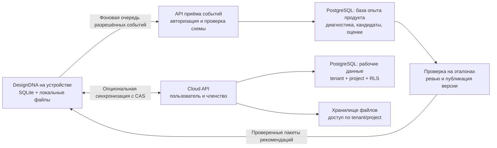

# PostgreSQL и общая база опыта DesignDNA

Дата: 13 сентября 2026. Статус: архитектурное предложение, без миграции, запуска серверов и включения передачи данных. Предположение: сохраняется локальная работа, облачная синхронизация подключается отдельно. Под «базой проекта» здесь понимается база самого продукта DesignDNA; отдельные дизайн-проекты остаются внутри пространства пользователя/команды.

## Рекомендация Codex

Сохранить SQLite и файлы на устройстве. Добавить PostgreSQL на сервере сначала для разрешённой диагностики и проверяемой базы опыта, затем — для синхронизации проектов и команд. Для облачных рабочих данных использовать общие таблицы с `tenant_id`, членством и RLS. Создавать личное пространство каждому пользователю, а отдельную физическую БД/кластер предлагать только при конкретной потребности в выделенном размещении.

«Своя база» для человека означает владение данными, приватность, экспорт, восстановление и управление доступом. Это не требует отдельного процесса PostgreSQL или базы на каждый аккаунт. SQLite подходит для локального хранения и кеша облачного приложения, включая работу при недоступной сети. [SQLite: подходящие применения](https://www.sqlite.org/whentouse.html).

## Что уже есть в текущем коде

| Область | Проверенный факт | Следствие для перехода |
|---|---|---|
| `app/storage/db.py` | Общий SQLite connect, WAL, busy timeout, SQL-миграции | Есть точка входа, но SQL и транзакции владельцев всё ещё SQLite-специфичны; одной заменой connection string не обойтись |
| `app/project_store.py:57` | `projects`, `taste_profiles`, `taste_events`; ключи включают user/project | Есть задел логического разделения. Defaults `local-user/default` не являются облачной идентичностью |
| `app/api/project.py:14` | user/project приходят в запросе; `expectedRevision` необязателен | Облачный API должен получать личность из серверной сессии, проверять членство, требовать версию при обновлении. Локальные маршруты нельзя просто выставить в интернет |
| `app/project_store.py:330` | CAS сравнивает SHA-256 точного сохранённого JSON под `BEGIN IMMEDIATE` | Нужен атомарный серверный CAS, сохранение исходного представления и отдельный протокол конфликтов |
| `app/design_system/store.py:24` | Ревизии ДС привязаны к system/project, tenant сейчас нет | Tenant должен появиться во всех таблицах, ссылках и запросах ДС, а не только в projects |
| `app/llm_trace.py`, `desktop/services/llm-trace.mjs` | JSONL метаданных; error обрезается до 300 символов | Обрезка текста не обезличивание. Облачный event DTO должен принимать только разрешённые поля и нормализованные коды ошибок |
| `app/project_store.py:149` | Память вкуса содержит `recent_prompts`; события сохраняют тексты | Это частная память пользователя, не готовый источник общей телеметрии |
| `app/cache_store.py`, blobs | Кеш и файлы локальны | Кеш не синхронизировать по умолчанию; файлы переносить через отдельное хранилище с проверкой владения |

Текущие ограничения владельца ноды/листа, canonical IR, Source, pinned DS revisions и undo-истории должны сохраниться. Замена СУБД не исправляет асинхронность UI и не создаёт протокол синхронизации.

## Разделение данных

Это три логических области: локальная частная работа, облачные рабочие данные и знания продукта. Две облачные БД могут сначала жить в одном управляемом кластере с разными ролями; это разделяет права, но не ресурсы и область отказа. При росте нагрузки или требованиях к изоляции — разные кластеры. Между рабочей БД и базой опыта нет прямого доступа к проектам со стороны аналитики; передача идёт через явно ограниченный контракт.

| Модель облака | Плюсы | Издержки | Предлагаемый выбор |
|---|---|---|---|
| Database per user | Отдельный логический дамп и права подключения | Миграции и управление соединениями множатся; неудобны команды и передача владения | Не основной режим |
| Schema per tenant | Удобно разделить объекты и некоторые операции экспорта | Миграции по схемам; безопасность зависит от grants и search_path | Только при конкретной необходимости |
| Общие таблицы + RLS | Одна схема и миграция, удобны команды | Нужны строгие политики, тесты и отдельный экспорт/restore tenant | Основной облачный режим |
| Локальный SQLite + облако | Быстрая локальная работа, offline-редактирование, постепенный переход | Два хранилища и явный sync-протокол | Основная продуктовая архитектура |

БД и кластер различаются: отдельные БД одного кластера разделяют ресурсы и кластерные роли. `search_path` выбирает имена объектов, но сам не обеспечивает изоляцию. [PostgreSQL: databases и schemas](https://www.postgresql.org/docs/current/ddl-schemas.html).

Пользователь может входить в несколько команд; личное пространство — tenant с одним участником. Сервер проверяет членство и проектные права. Runtime-роль не должна быть владельцем таблиц, superuser или иметь BYPASSRLS; политики `USING/WITH CHECK` проверяют чтение и запись. Контекст tenant задаётся доверенным API внутри транзакции через `SET LOCAL`/`set_config(..., true)` и не переживает возврат соединения в пул; отсутствие контекста закрывает доступ. Составные ключи/ссылки включают tenant, доступ к файлам проверяется отдельно. [PostgreSQL: RLS](https://www.postgresql.org/docs/current/ddl-rowsecurity.html), [область действия SET LOCAL](https://www.postgresql.org/docs/current/sql-set.html).

## CAS, синхронизация и файлы

На первом этапе хранить `payload_raw TEXT` как авторитетное представление проекта и `revision_hash` от его UTF-8 байтов. `JSONB` использовать для отдельно выделенных метаданных и поисковой проекции. Не получать исходный payload обратным преобразованием JSONB: он не сохраняет пробелы и порядок ключей. Переход на другую канонизацию — отдельная версия контракта, а не побочный эффект миграции. [PostgreSQL: JSON types](https://www.postgresql.org/docs/current/datatype-json.html).

Обновление: условный `UPDATE ... WHERE tenant_id = ... AND project_id = ... AND revision_hash = expected RETURNING ...` вместе с записью новой ревизии и outbox-события в одной транзакции. Ноль обновлённых строк требует проверки отсутствия/прав/конфликта. Создание — отдельный путь с уникальным ключом. Не использовать `xmin` как постоянный идентификатор версии. Поведение конкурентного UPDATE позволяет переоценить условие после ожидания другой транзакции. [PostgreSQL: transaction isolation](https://www.postgresql.org/docs/current/transaction-iso.html).

Локальный commit и намерение синхронизации пишутся атомарно в одну SQLite-БД. Событие содержит `operation_id`, tenant/project/device, базовую ревизию и ссылку на точный снимок. Доставка допускает повтор, сервер дедуплицирует operation ID и возвращает уже записанный результат. ACK означает серверный commit. Очередь имеет квоту, задержку повторов и понятное состояние; сбой аналитики не блокирует ноду или локальное сохранение. [Transactional outbox](https://docs.aws.amazon.com/prescriptive-guidance/latest/cloud-design-patterns/transactional-outbox.html).

Для двух устройств сначала достаточно явного конфликта с сохранением обеих версий; молчаливый last-write-wins недопустим. CRDT и слияние графа по операциям — последующий самостоятельный этап. Удаление передаёт tombstone и поколение объекта; слишком старое устройство проходит полную сверку, чтобы не воскресить удалённый проект. Отзыв доступа проверяется и для старой очереди.

Файлы загружаются до публикации облачного снимка; сервер проверяет наличие и SHA. В БД — manifest и права, в object storage — байты. Локальный `ddna://` остаётся устойчивым идентификатором; синхронизация подкачивает файл, не переписывая канонический IR на временный URL. Хеш не является разрешением на чтение чужого файла. Очистка не удаляет файлы, на которые ссылаются сохранённые ревизии.

Бэкап PostgreSQL и файлов восстанавливается как согласованный набор. Для общей БД нужен отдельный tenant export/import; восстановление состояния всего кластера не означает простого PITR одного пользователя. Задать RPO/RTO и регулярно проверять восстановление, включая DS hashes и истории. [PostgreSQL: backup and restore](https://www.postgresql.org/docs/current/backup.html).

## Как получать полезные best practices

Разделить частную память пользователя, диагностику стабильности, агрегированные продуктовые метрики и добровольно переданные примеры. Для облачной передачи — раздельные настройки целей; материалы и примеры отправляются явно. По умолчанию не передавать промпты, IR, скриншоты, URL, имена файлов, исходные сообщения ошибок, ключи и токены. Псевдонимный ID всё ещё требует правил доступа и срока хранения.

Полезный event: тип ноды и операции, стадия, нормализованный outcome/error_code, provider/model/effort, версии приложения/контракта/политики, длительность и число попыток, результаты проверок и явная оценка пользователя. Локальные page/node/run IDs связываются внутри частного журнала; облако получает только необходимые непрямые идентификаторы.

Цикл: наблюдение → гипотеза → очищенный кандидат → baseline и независимая контрольная выборка → оценка и ревью → опубликованная версия → ограниченное применение → мониторинг и отзыв. Хранить положительные и отрицательные результаты, применимость и ограничения. Повторять измерения по задачам и пользователям; не выдавать сто запусков одного проекта за сто независимых подтверждений.

В карточке практики нужны `node_type`, задача/условия, версия модели и промпта, предлагаемая стратегия, доказательства, сравнение с baseline, жёсткие ограничения, статус `candidate/evaluated/approved/retired`, версия и причина отката. Тексты кандидатов — недоверенные данные; они не становятся исполняемыми командами или инструкциями высшего приоритета.

Отзыв согласия прекращает новые отправки и повтор старой очереди. Для связанных кандидатов, оценок, поисковых индексов и бэкапов заранее определить удаление/сроки. Опубликованные материалы не считать автоматически обезличенными: сохранять происхождение и возможность отозвать производную практику. Диагностика может выявить гипотезу, но сама не заменяет оценивание результата.

| Ноды | Полезный результат базы опыта | Что нельзя менять автоматически |
|---|---|---|
| Source Import | Проверенные стратегии ожидания/захвата по классу страницы, причины повторов | Содержимое и геометрию источника |
| Design System | Выбор проверенной стратегии восстановления, покрытие состояний | componentRef, masterHash, точные мастера |
| Generator/Derive/Mix | Рекомендации по структуре задачи и составу контекста с учётом модели | Выбранную ДС, провайдера, пользовательский замысел |
| Images | Проверенные инструкции по композиции, прозрачности, согласованности серии | Авторские материалы других пользователей |
| Video | Подходящие стратегии длительности/переходов и качества экспорта | Canonical source IR, историю и явные настройки ролика |
| Quality | Эталоны, детекторы дефектов, сравнение стратегий ремонта | Критерии приёмки ради повышения собственного балла |

Пакет рекомендаций загружается и проверяется заранее, кешируется локально, фиксируется по версии на время запуска ноды. Отключение сети или публикация новой версии не меняет текущий прогон. Глобальная рекомендация не переопределяет частные ограничения проекта. Доставку промптов сохранять через `app/prompts/` и версионированный контракт; облачную замену пакетов вводить отдельным проверяемым механизмом.

## Минимальные сущности и этапы

Локально: отдельные профили аккаунтов при их появлении, `sync_outbox`, `sync_state`, `consents`, журнал outcomes и кеш опубликованных практик. Облако рабочих данных: `users`, `tenants`, `memberships`, `projects`, `project_revisions`, `design_systems`, `design_system_revisions`, `asset_manifest`, `processed_operations`, `tombstones`. Облако опыта: `diagnostic_events`, `practice_candidates`, `eval_runs`, `practice_revisions`, `releases`, записи происхождения и удаления. Это целевая карта, не предложение создавать все таблицы сразу.

1. **Первый самостоятельный MVP — локальный журнал опыта.** Уточнить outcome-контракт и согласия; записывать структурированные результаты, использовать существующие quality/fidelity проверки. Сделать ручной просмотр кандидатов и их экспорт без отправки по умолчанию. PostgreSQL для этого ещё не обязателен.
2. **Первое применение PostgreSQL — сервис базы опыта.** Авторизованный приём разрешённых событий, дедупликация, короткий retention диагностики, baseline/eval/review, чтение только опубликованных версий. Он может дать пользу без переноса проектов в облако.
3. **Затем облачные проекты, если нужны несколько устройств/команды.** Auth/membership, PostgreSQL RLS, blob storage, snapshot sync с CAS и обеими версиями при конфликте. Существующие SQLite-store остаются; выделять интерфейсы хранилищ по доменам, не универсальную SQL-обёртку.
4. **Рост по измерениям.** Отдельные кластеры/tenant placement, разделение потоков, партиционирование. Kafka, ClickHouse и pgvector не нужны для начального журнала: вводить по измеренным задержкам/объёму/потребности поиска. Число зарегистрированных пользователей само по себе не определяет архитектуру.

Переиспользовать [разбор autoresearch](C:/Users/iamma/Documents/desingaiweb/docs/autoresearch-integration-review-2026-09-10.md), `tools/quality_report.py` и `app/fidelity_harness.py`; они дают основу проверок, но не готовую систему коллективного обучения. Это улучшение инструкций и выбора стратегий, не обучение весов Claude/Codex.

Критерии приёмки: чужой tenant закрыт во всех CRUD/экспортах/файлах и при повторном использовании соединения; два обновления одной ревизии не теряют данные; повтор и обрыв до ACK не дублируют эффект; offline не мешает сохранению; поздний ответ не изменяет другую ноду; старое устройство не воскрешает удаление; отключённое согласие останавливает очередь; неизвестное поле/сырой error не проходит ingestion; migration/restore сохраняют hashes/Undo; отозванная практика не запускается, pinned-прогон остаётся воспроизводимым.

## Независимый ответ Grok

Grok получил общую архитектурную постановку без внутренних деталей проекта и подготовил рекомендации в [текущей беседе](https://grok.com/c/0c899e1a-b885-4ef5-a385-c4d722edf0c1?rid=24033522-842b-4df2-b29e-993f9ef175d4). Полные ответы находятся в беседе; [краткая сводка и сопоставление](C:/Users/iamma/Documents/desingaiweb/artifacts/postgresql-architecture-2026-09-13/grok-summary.md) сохранены локально. Точная версия модели в UI не указана; ответы получены фактически, тесты Grok не запускал.

Его основные выводы совпадают: tenant не равен пользователю, массовая database-per-user не нужна, локальное хранилище стоит сохранить, общую базу знаний отделить от рабочих данных, сбор материалов и публикацию практик делать отдельными управляемыми этапами. Привязка к текущему коду и предложенный порядок внедрения выше — собственный анализ Codex.

В [уточняющем ответе](https://grok.com/c/0c899e1a-b885-4ef5-a385-c4d722edf0c1?rid=9b422c65-521c-4434-aaaf-f72e3d20f65f) Grok согласился с пятью поправками: database не равна cluster; search_path не даёт изоляцию; tenant-контекст ограничивается транзакцией; xmin не является долговечной внешней ревизией; публикация сама не доказывает обезличивание. Он поддержал порядок «сначала опыт, потом синхронизация», если главная цель — проверяемые рекомендации. Если первоочередная потребность — доступ с нескольких устройств или совместная работа, эти этапы следует поменять местами. Долговечность xmin отдельно сверена по [официальному описанию системных колонок](https://www.postgresql.org/docs/current/ddl-system-columns.html); в sync-контракте используются собственные версии.

Подробный первоначальный бриф был отклонён автоматической проверкой передачи непубличных сведений. Выполнена безопасная альтернатива: Grok отправлена общая постановка, а сопоставление с локальным кодом сделано здесь. Базы, подключения, согласия и передача пользовательских событий в этой задаче не менялись.
