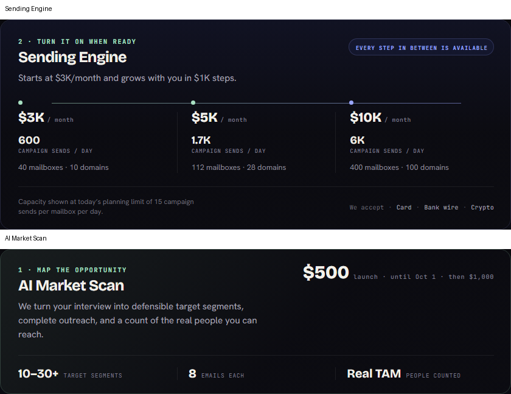
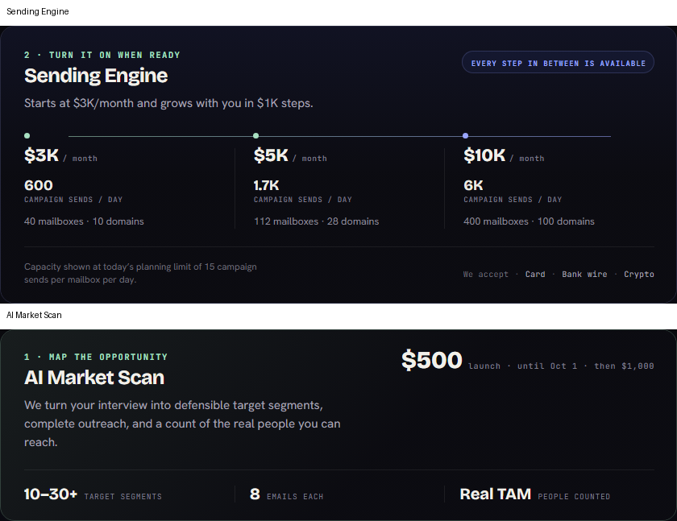

# SLSBMB master layout polish (P10)

Live fixture: published revision 1 of `SLSBMB Pricing Kit` (`ds-98d49b55acd6`). The database, captured fonts, and blobs were copied from `%APPDATA%\@designdna\desktop\data` to the isolated directory `%TEMP%\designdna-slsbmb-polish-p10-63301e00a048491baebf6639771f661e`; the desktop data was not modified.

The run covered `Sending Engine` (`list-item`) and `AI Market Scan` (`list-item-review`). Both deterministic candidates were rejected and the exact original masters were retained: Sending Engine would have introduced a new defect and still contained an `escape`; AI Market Scan still contained an `escape`. Thus the before/after PNGs are intentionally pixel-identical. This is the safety result P9 lacked: a lower raw defect count is no longer enough to accept a layout mutation.

## Results

Counts below are unique `(sourceKey, kind)` defects within each independently rendered viewport. `O/C/E/L` means overflow / clip / escape / overlap. `wrap` was zero because this capture does not carry measured source line counts; the check remains active when those measurements are present.

| Master | Viewport | Before | After | Kind counts before → after | Pixel similarity after | Decision |
|---|---:|---:|---:|---|---:|---|
| Sending Engine | desktop | 31 | 31 | 14/14/3/0 → 14/14/3/0 | 96.57% | rejected; exact rollback |
| Sending Engine | tablet | 31 | 31 | 14/14/3/0 → 14/14/3/0 | 96.48% | rejected; exact rollback |
| Sending Engine | mobile | 35 | 35 | 16/16/3/0 → 16/16/3/0 | 94.87% | rejected; exact rollback |
| AI Market Scan | desktop | 9 | 9 | 4/4/1/0 → 4/4/1/0 | 96.82% | rejected; exact rollback |
| AI Market Scan | tablet | 9 | 9 | 4/4/1/0 → 4/4/1/0 | 96.22% | rejected; exact rollback |
| AI Market Scan | mobile | 9 | 9 | 4/4/1/0 → 4/4/1/0 | 93.88% | rejected; exact rollback |

The previous 95-item Sending Engine result mixed repeated viewport findings and renderer-fragment overlaps. Global deduplication by `(sourceKey, kind)` reduces the honest cross-viewport list to 41 items (19 overflow, 19 clip, 3 escape); intentional `::pseudo-*` / `::text*` layers of the same source element are no longer reported as sibling overlaps. The remaining 1–3 px overflow/clip entries are browser-measured scroll/clipping deltas, not duplicates, and are retained instead of silently weakening the lint threshold.

The three Sending Engine escapes are the price glyph frames (`$3K`, `$5K`, `$10K`) extending 2 px above/below their immediate 22 px containers. AI Market Scan has the analogous `$500` frame extending 3 px outside its 30 px parent; its trailing `launch · until Oct 1 · then $1,000` text remains at the captured edge, so the deterministic pass does not invent card growth or move neighbours. These masters remain in “needs polish” rather than receiving an unsafe automatic edit.

| Before | After |
|---|---|
|  |  |

Individual evidence: [Sending Engine before](slsbmb-polish-sending-before.png), [Sending Engine after](slsbmb-polish-sending-after.png), [AI Market Scan before](slsbmb-polish-ai-before.png), [AI Market Scan after](slsbmb-polish-ai-after.png).
